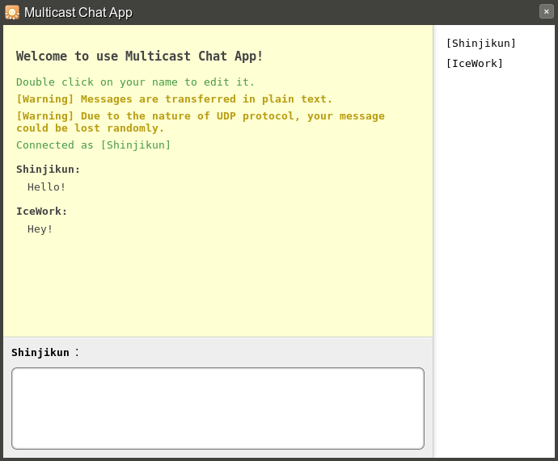

# Multicast Chatting

This sample shows how to send and receive [multicast
socket](http://en.wikipedia.org/wiki/Multicast) diagrams in local network from
Chrome apps. It joins the multicast socket group 237.132.123.123 and listens on
port 3038.

To support multicast socket messaging in your local network requires the
support of your router. The connectivity of this app varies depending on the
network configuration.

__Warning: This is a simple chatting app demonstrating the usage of multicast
socket Chrome app API. It is not designed for reliable communication. Privacy
and reachability of the message is NOT guaranteed. It is also possible that a
user is able to send to another user while not being able to receive from the
latter.__

## APIs
* [Messaging](https://developer.chrome.com/apps/runtime.html)
* [Runtime](https://developer.chrome.com/apps/app.runtime.html)
* [Storage](https://developer.chrome.com/apps/storage.html)
* [Sockets](https://developer.chrome.com/apps/sockets_udp)
* [Window](https://developer.chrome.com/apps/app.window.html)

## Screenshot

